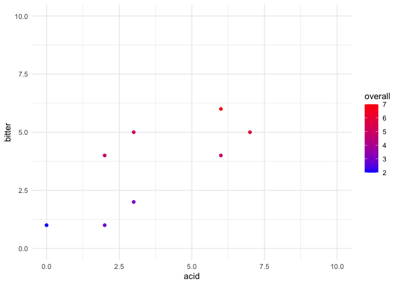

Coffee experiment anlysis
================

``` r
library(tidyverse)
```

    ## ── Attaching packages ─────────────────────────────────────────────────────────────────────────────────────────────────────────────────────────────────── tidyverse 1.3.0 ──

    ## ✓ ggplot2 3.3.0     ✓ purrr   0.3.4
    ## ✓ tibble  3.0.0     ✓ dplyr   0.8.5
    ## ✓ tidyr   1.0.2     ✓ stringr 1.4.0
    ## ✓ readr   1.3.1     ✓ forcats 0.5.0

    ## ── Conflicts ────────────────────────────────────────────────────────────────────────────────────────────────────────────────────────────────────── tidyverse_conflicts() ──
    ## x dplyr::filter() masks stats::filter()
    ## x dplyr::lag()    masks stats::lag()

``` r
theme_set(theme_minimal())
```

## Assemble the design matrix

Load the fractional
design…

``` r
design <- read.csv('half_factorial_design_four.csv',stringsAsFactors = FALSE)
print(design)
```

    ##   run factor_1 factor_2 factor_3 factor_4
    ## 1   1       -1       -1       -1       -1
    ## 2   2        1       -1       -1        1
    ## 3   3       -1        1       -1        1
    ## 4   4        1        1       -1       -1
    ## 5   5       -1       -1        1        1
    ## 6   6        1       -1        1       -1
    ## 7   7       -1        1        1       -1
    ## 8   8        1        1        1        1

…and the values of the factor levels

``` r
levels <- read.csv('factor_levels.csv',stringsAsFactors = FALSE)
print(levels)
```

    ##       variable   factor level value
    ## 1   grind_size factor_1    -1     3
    ## 2   grind_size factor_1     1    16
    ## 3 grams_coffee factor_2    -1    10
    ## 4 grams_coffee factor_2     1    20
    ## 5   water_temp factor_3    -1   175
    ## 6   water_temp factor_3     1   200
    ## 7   steep_time factor_4    -1    30
    ## 8   steep_time factor_4     1    60

Reshape the design matrix so it is easier to join with the levels

``` r
design_long <- pivot_longer(design,cols=c(
  'factor_1','factor_2','factor_3','factor_4'
), names_to="factor", values_to = "level")
head(design_long)
```

    ## # A tibble: 6 x 3
    ##     run factor   level
    ##   <int> <chr>    <int>
    ## 1     1 factor_1    -1
    ## 2     1 factor_2    -1
    ## 3     1 factor_3    -1
    ## 4     1 factor_4    -1
    ## 5     2 factor_1     1
    ## 6     2 factor_2    -1

Join design with
levels

``` r
design_levels_long <- design_long %>% inner_join(levels, by = c("factor","level"))
head(design_levels_long)
```

    ## # A tibble: 6 x 5
    ##     run factor   level variable     value
    ##   <int> <chr>    <int> <chr>        <int>
    ## 1     1 factor_1    -1 grind_size       3
    ## 2     1 factor_2    -1 grams_coffee    10
    ## 3     1 factor_3    -1 water_temp     175
    ## 4     1 factor_4    -1 steep_time      30
    ## 5     2 factor_1     1 grind_size      16
    ## 6     2 factor_2    -1 grams_coffee    10

Now reshape back to wide
format

``` r
design_levels <- pivot_wider(design_levels_long, id_cols='run', names_from = 'variable', values_from = 'value')
print(design_levels)
```

    ## # A tibble: 8 x 5
    ##     run grind_size grams_coffee water_temp steep_time
    ##   <int>      <int>        <int>      <int>      <int>
    ## 1     1          3           10        175         30
    ## 2     2         16           10        175         60
    ## 3     3          3           20        175         60
    ## 4     4         16           20        175         30
    ## 5     5          3           10        200         60
    ## 6     6         16           10        200         30
    ## 7     7          3           20        200         30
    ## 8     8         16           20        200         60

## Read in results data

``` r
results <- read.csv('run_results.csv',stringsAsFactors = FALSE)
results_levels <- results %>% inner_join(design_levels, by= 'run')
str(results_levels)
```

    ## 'data.frame':    8 obs. of  10 variables:
    ##  $ date        : chr  "2020-04-29" "2020-04-30" "2020-05-01" "2020-05-02" ...
    ##  $ run         : int  8 1 3 7 4 5 2 6
    ##  $ acid        : int  7 3 6 6 2 2 0 3
    ##  $ bitter      : int  5 2 4 6 4 1 1 5
    ##  $ overall     : int  6 3 5 7 5 3 2 5
    ##  $ water_grams : int  160 240 NA 171 187 192 200 186
    ##  $ grind_size  : int  16 3 3 3 16 3 16 16
    ##  $ grams_coffee: int  20 10 20 20 20 10 10 10
    ##  $ water_temp  : int  200 175 175 200 175 200 175 200
    ##  $ steep_time  : int  60 30 60 30 30 60 60 30

### Quick look at the correlation between outcome variables

Plot our outcomes: acidity, bitterness, and overall enjoyment

``` r
ggplot(results_levels,aes(acid,bitter,color=overall))+geom_point()+
  scale_color_gradient(high='red',low='blue')+
  xlim(c(0,10))+ylim(c(0,10))
```

<!-- -->

Regress overall enjoyment on bitterness and acidity

``` r
summary(lm(overall ~ acid * bitter, data=results_levels))
```

    ## 
    ## Call:
    ## lm(formula = overall ~ acid * bitter, data = results_levels)
    ## 
    ## Residuals:
    ##       1       2       3       4       5       6       7       8 
    ## -0.1021 -0.2729 -0.1473  0.2870  0.4485  0.5207 -0.3195 -0.4143 
    ## 
    ## Coefficients:
    ##             Estimate Std. Error t value Pr(>|t|)  
    ## (Intercept)  1.67482    0.57664   2.904   0.0439 *
    ## acid         0.05686    0.24208   0.235   0.8258  
    ## bitter       0.64471    0.20514   3.143   0.0348 *
    ## acid:bitter  0.02302    0.05464   0.421   0.6952  
    ## ---
    ## Signif. codes:  0 '***' 0.001 '**' 0.01 '*' 0.05 '.' 0.1 ' ' 1
    ## 
    ## Residual standard error: 0.4835 on 4 degrees of freedom
    ## Multiple R-squared:  0.9533, Adjusted R-squared:  0.9182 
    ## F-statistic: 27.19 on 3 and 4 DF,  p-value: 0.004033

So, bitterness seems to contribute pretty much soley to my enjoyment of
the coffee.

Of course I was using the same blend of beans throughout (Holy Mountain
from [Chromatic Coffee](https://www.chromaticcoffee.com/)). Description
of [Holy Mountain
blend](https://www.chromaticcoffee.com/holy-mountain-blend/) from their
site:

> This year’s Holy Mountain is resonant, and darkly bright, if you can
> somehow picture that. Imagine a heavy bodied, creamy and velvety shot
> of classic espresso with tropical fruit notes and a richly dark single
> origin cacao from Ecuador thats been roasted perfectly. It also makes
> a loud and dense cup of coffee. We’re pretty focused on mouthfeel with
> this one so revel in its textural journey\! A three bean blend with a
> PNG Kunjin base, a Honduras Parainema micro-lot bridge, and a robust
> and fruited Amazonian coffee our green buyer bought at auction where
> he got the \#1, \#2, \#3, and \#4 winners\! Prepare for an
awakening.

## Analysis of experimental results

### Acidity Main Effects

``` r
acid_main_effects <- lm(acid ~ water_temp + grind_size + grams_coffee + steep_time, data=results_levels)
summary(acid_main_effects)
```

    ## 
    ## Call:
    ## lm(formula = acid ~ water_temp + grind_size + grams_coffee + 
    ##     steep_time, data = results_levels)
    ## 
    ## Residuals:
    ##      1      2      3      4      5      6      7      8 
    ##  1.375  1.375  0.875 -0.625 -1.625 -1.625 -0.625  0.875 
    ## 
    ## Coefficients:
    ##                Estimate Std. Error t value Pr(>|t|)  
    ## (Intercept)  -13.836538  10.800845  -1.281   0.2902  
    ## water_temp     0.070000   0.055076   1.271   0.2933  
    ## grind_size    -0.096154   0.105915  -0.908   0.4309  
    ## grams_coffee   0.325000   0.137689   2.360   0.0994 .
    ## steep_time     0.008333   0.045896   0.182   0.8675  
    ## ---
    ## Signif. codes:  0 '***' 0.001 '**' 0.01 '*' 0.05 '.' 0.1 ' ' 1
    ## 
    ## Residual standard error: 1.947 on 3 degrees of freedom
    ## Multiple R-squared:  0.7284, Adjusted R-squared:  0.3662 
    ## F-statistic: 2.011 on 4 and 3 DF,  p-value: 0.2963

### Bitterness Main Effects

``` r
bitter_main_effects <- lm(bitter ~ water_temp + grind_size + grams_coffee + steep_time, data=results_levels)
summary(bitter_main_effects)
```

    ## 
    ## Call:
    ## lm(formula = bitter ~ water_temp + grind_size + grams_coffee + 
    ##     steep_time, data = results_levels)
    ## 
    ## Residuals:
    ##          1          2          3          4          5          6 
    ##  1.221e-15  1.485e-15  1.000e+00 -2.619e-18 -1.000e+00 -1.000e+00 
    ##          7          8 
    ## -1.542e-16  1.000e+00 
    ## 
    ## Coefficients:
    ##              Estimate Std. Error t value Pr(>|t|)  
    ## (Intercept)  -9.61538    6.40490  -1.501   0.2303  
    ## water_temp    0.06000    0.03266   1.837   0.1635  
    ## grind_size    0.03846    0.06281   0.612   0.5836  
    ## grams_coffee  0.25000    0.08165   3.062   0.0549 .
    ## steep_time   -0.05000    0.02722  -1.837   0.1635  
    ## ---
    ## Signif. codes:  0 '***' 0.001 '**' 0.01 '*' 0.05 '.' 0.1 ' ' 1
    ## 
    ## Residual standard error: 1.155 on 3 degrees of freedom
    ## Multiple R-squared:  0.8462, Adjusted R-squared:  0.641 
    ## F-statistic: 4.125 on 4 and 3 DF,  p-value: 0.1369

### Overall main effects

``` r
overall_main_effects <- lm(overall ~ water_temp + grind_size + grams_coffee + steep_time, data=results_levels)
summary(overall_main_effects)
```

    ## 
    ## Call:
    ## lm(formula = overall ~ water_temp + grind_size + grams_coffee + 
    ##     steep_time, data = results_levels)
    ## 
    ## Residuals:
    ##          1          2          3          4          5          6 
    ##  1.554e-15  1.683e-15  5.000e-01 -1.894e-17 -5.000e-01 -5.000e-01 
    ##          7          8 
    ## -1.440e-16  5.000e-01 
    ## 
    ## Coefficients:
    ##                Estimate Std. Error t value Pr(>|t|)   
    ## (Intercept)  -9.000e+00  3.202e+00  -2.810  0.06727 . 
    ## water_temp    6.000e-02  1.633e-02   3.674  0.03490 * 
    ## grind_size    7.891e-17  3.140e-02   0.000  1.00000   
    ## grams_coffee  2.500e-01  4.082e-02   6.124  0.00875 **
    ## steep_time   -3.333e-02  1.361e-02  -2.449  0.09172 . 
    ## ---
    ## Signif. codes:  0 '***' 0.001 '**' 0.01 '*' 0.05 '.' 0.1 ' ' 1
    ## 
    ## Residual standard error: 0.5774 on 3 degrees of freedom
    ## Multiple R-squared:   0.95,  Adjusted R-squared:  0.8833 
    ## F-statistic: 14.25 on 4 and 3 DF,  p-value: 0.02711

### Subsequent models

Remove grind size variable and add two-way interaction
terms

``` r
overall_model2 <- lm(overall ~ water_temp*grams_coffee + water_temp*steep_time + steep_time*grams_coffee, data=results_levels)
summary(overall_model2)
```

    ## Warning in summary.lm(overall_model2): essentially perfect fit: summary may
    ## be unreliable

    ## 
    ## Call:
    ## lm(formula = overall ~ water_temp * grams_coffee + water_temp * 
    ##     steep_time + steep_time * grams_coffee, data = results_levels)
    ## 
    ## Residuals:
    ##          1          2          3          4          5          6 
    ##  1.452e-15 -1.452e-15 -1.452e-15 -1.452e-15  1.452e-15 -1.452e-15 
    ##          7          8 
    ##  1.452e-15  1.452e-15 
    ## 
    ## Coefficients:
    ##                           Estimate Std. Error    t value Pr(>|t|)    
    ## (Intercept)             -1.800e+01  9.606e-14 -1.874e+14 3.40e-15 ***
    ## water_temp               1.200e-01  5.064e-16  2.369e+14 2.69e-15 ***
    ## grams_coffee             1.000e-01  4.453e-15  2.246e+13 2.83e-14 ***
    ## steep_time               1.667e-01  1.484e-15  1.123e+14 5.67e-15 ***
    ## water_temp:grams_coffee  2.364e-17  2.324e-17  1.017e+00    0.494    
    ## water_temp:steep_time   -1.333e-03  7.746e-18 -1.721e+14 3.70e-15 ***
    ## grams_coffee:steep_time  3.333e-03  1.936e-17  1.721e+14 3.70e-15 ***
    ## ---
    ## Signif. codes:  0 '***' 0.001 '**' 0.01 '*' 0.05 '.' 0.1 ' ' 1
    ## 
    ## Residual standard error: 4.108e-15 on 1 degrees of freedom
    ## Multiple R-squared:      1,  Adjusted R-squared:      1 
    ## F-statistic: 1.975e+29 on 6 and 1 DF,  p-value: 1.722e-15

Model above is saturated, remove
interactions

``` r
overall_model3 <- lm(overall ~ water_temp + grams_coffee + steep_time, data=results_levels)
summary(overall_model3)
```

    ## 
    ## Call:
    ## lm(formula = overall ~ water_temp + grams_coffee + steep_time, 
    ##     data = results_levels)
    ## 
    ## Residuals:
    ##          1          2          3          4          5          6 
    ##  1.943e-15  1.174e-15  5.000e-01 -5.427e-16 -5.000e-01 -5.000e-01 
    ##          7          8 
    ##  2.411e-16  5.000e-01 
    ## 
    ## Coefficients:
    ##              Estimate Std. Error t value Pr(>|t|)   
    ## (Intercept)  -9.00000    2.76134  -3.259  0.03110 * 
    ## water_temp    0.06000    0.01414   4.243  0.01324 * 
    ## grams_coffee  0.25000    0.03536   7.071  0.00211 **
    ## steep_time   -0.03333    0.01179  -2.828  0.04742 * 
    ## ---
    ## Signif. codes:  0 '***' 0.001 '**' 0.01 '*' 0.05 '.' 0.1 ' ' 1
    ## 
    ## Residual standard error: 0.5 on 4 degrees of freedom
    ## Multiple R-squared:   0.95,  Adjusted R-squared:  0.9125 
    ## F-statistic: 25.33 on 3 and 4 DF,  p-value: 0.004609

## Initial conclusions

  - Going through this experiment, I think I have learned what I want to
    achieve- a robust, bitter cup with lower acidity.
  - More coffee beans in grams -\> more bitterness, more acidity
  - It looks like 200F water and shorter steep times may be better, but
    I think we need more data
  - Looks like I will need to do this again to gather more data… not
    surprising
